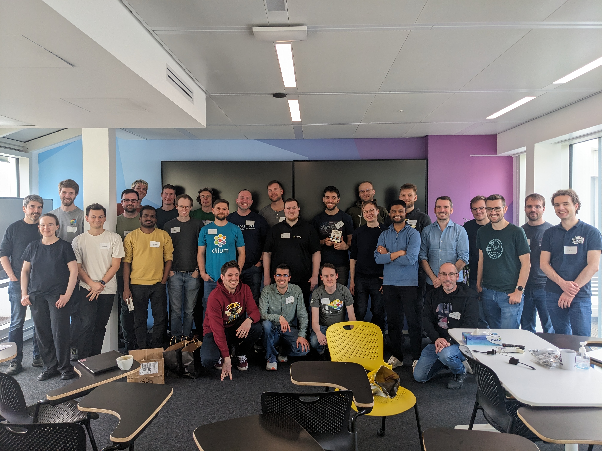

# Paris 2024

* [Schedule](https://docs.google.com/document/d/1w3nnzXgSTdTTWWpvlwS6sHIKmdDRc8Ox2uJBnPrnFWM/edit?usp=sharing)
* [Notes: Session 3-4](https://docs.google.com/document/d/1BP47IwjSZ_8_RGB_6jQh65i-ppuTJ7iZXsKazHblFnE/edit?usp=sharing)
* [Notes: Session 5-7](https://docs.google.com/document/d/1qhm5CIP6XQKe8gqRyzKOi53HTVQsh-wYDF6wN0g5Mig/edit?usp=sharing)

  ## Presentations

  * [PUBLIC Adopting Scalability Improvements in Cilium](https://docs.google.com/presentation/d/1htcMXuriYO7H4boge1S9OLYbFGGF3HHwK4sPbiz1lIU/edit?usp=sharing)
  * [PUBLIC OSS Cilium Dev Summit Paris: Cilium + xDS](https://docs.google.com/presentation/d/1PHI1zSM0BGeTZ09YEIvVSYyZvxhZq8gVv8Kp6RQlAyc/edit?usp=sharing&resourcekey=0-Iq6zepRBv4orWRtdBCaVQQ)

  
