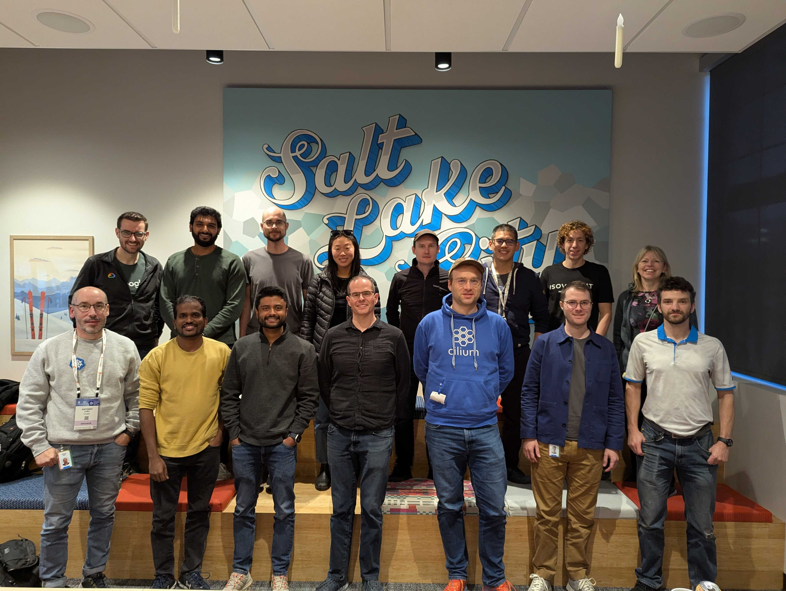

# Salt Lake City 2024 

* [Schedule](https://docs.google.com/document/d/1lP9Lpcxinb3QnQ5Mfe3pDVEDWg9vDl_wEmE3IZP-ls4/edit?usp=sharing)
* [Raw notes](https://docs.google.com/document/d/10CfirzQsA0Ze-l216NYbuVuhWcC0-hXagCv7BtXK4_M/)

## Presentations

* [Cilium Datapath Plugins](./Cilium-Datapath-Plugins-Public.pdf)
* [HA DNS Proxy](./devsummit_talk.pptm)
* [BGP Route Learning](./SwaffordBGPNov2024.pdf)
* [New Contributor Experience](https://docs.google.com/presentation/d/1CCzI7rR3rgN5XmeapW29-lqauHDXkcIReJ_2D9XwTSY/edit#slide=id.p)

## Recording

[Full Recording on Youtube](https://youtu.be/iiV121VmoMM)

00:00 Cilium Datapath Plugins
00:54 Making Hubble a standard observability platform irrespective of CNI
01:23 Multi cluster observability and traffic management (discussion).
02:11 HA DNS Proxy
04:02 BGP Route Learning
04:42 Cilium + wireguard.
05:08 Contributor experience + CFP process improvements
06:02 xDS for Cilium
06:23 Kubernetes Network Drivers (got cut off at the end)

